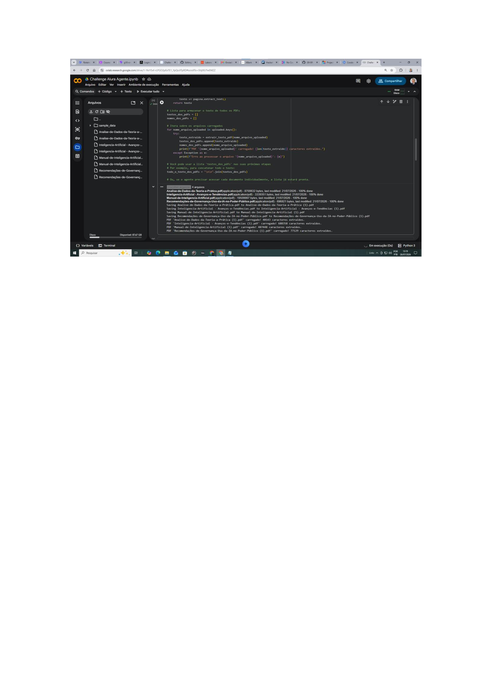
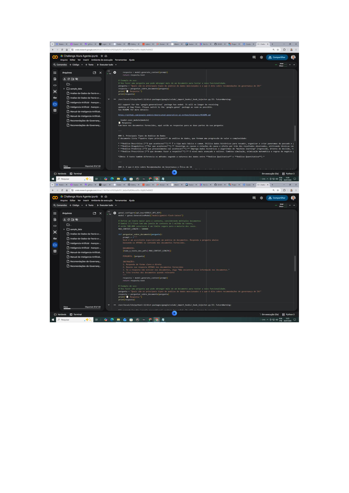
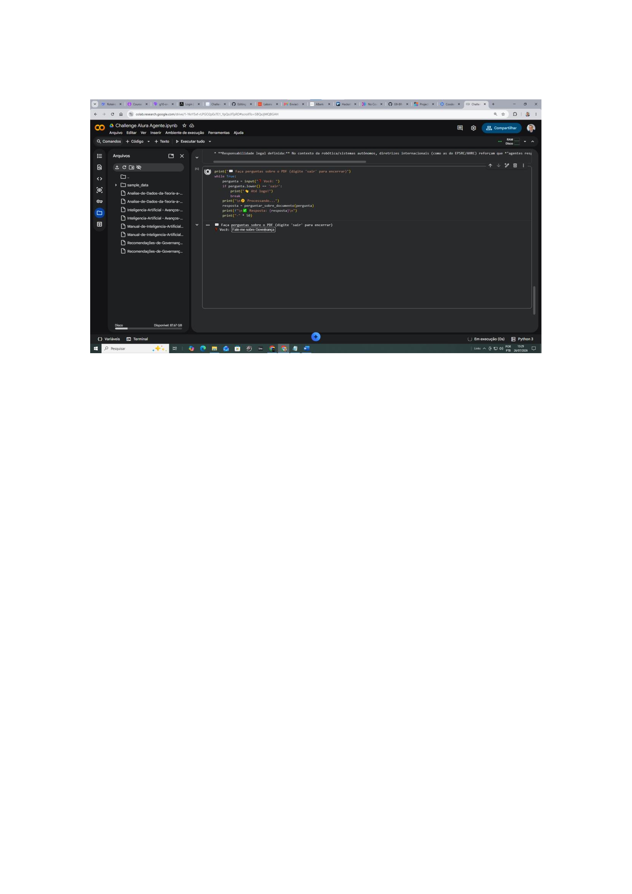
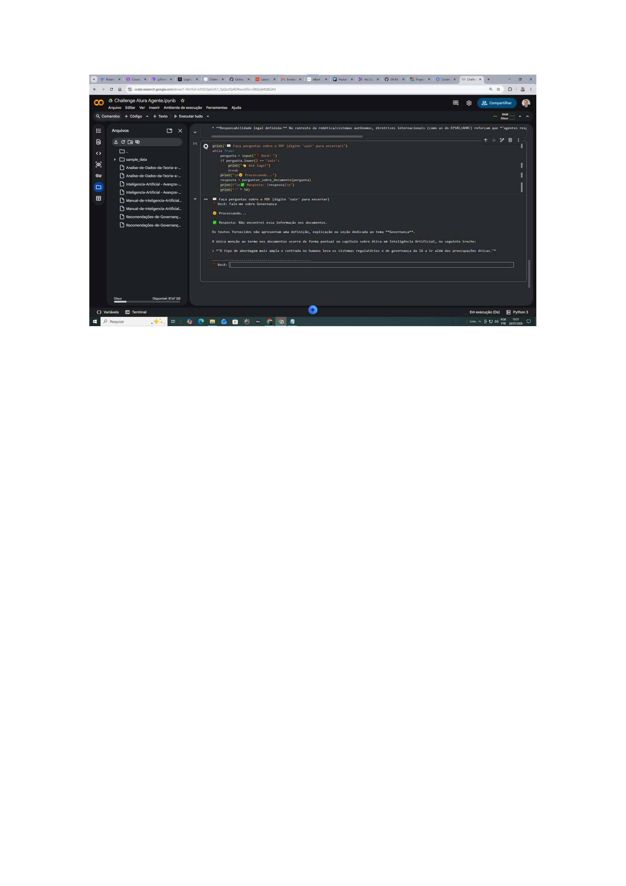
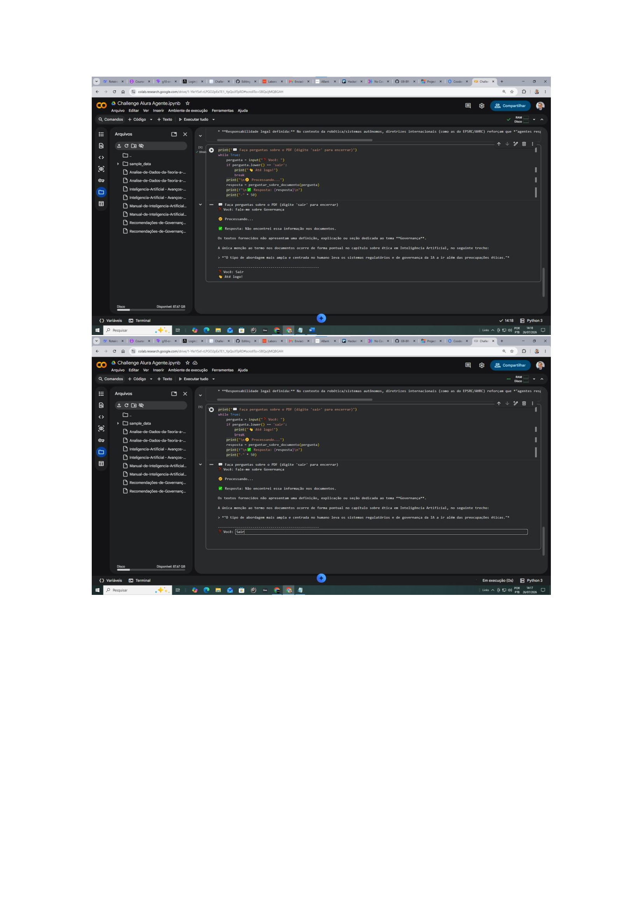
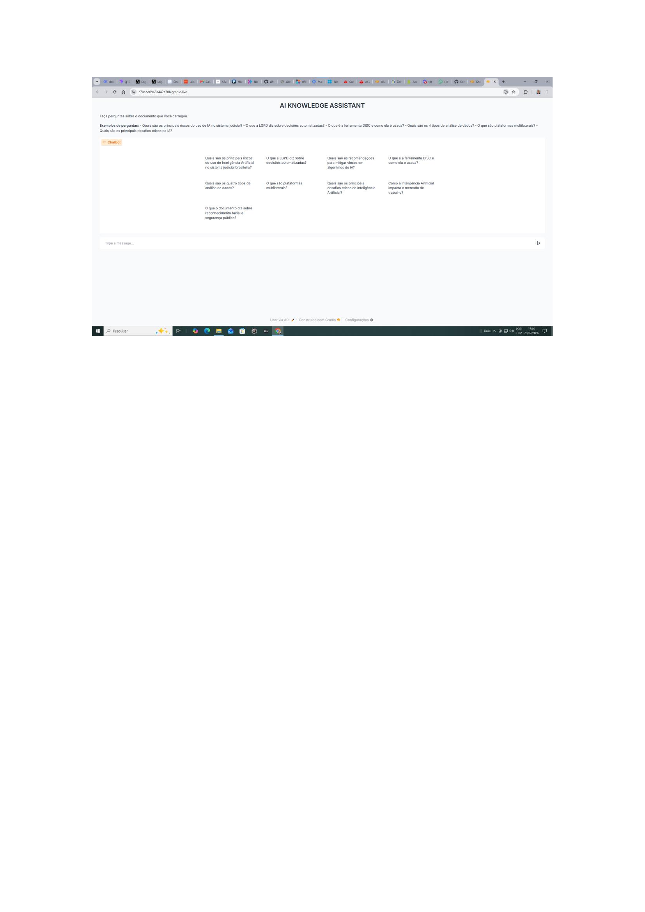
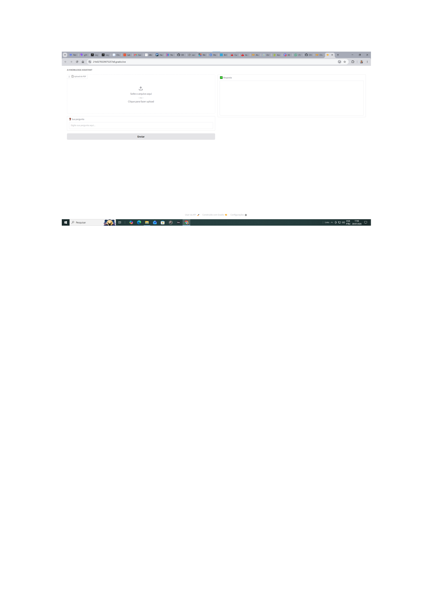

# AI KNOWLEDGE ASSISTANT

Agente Inteligente,  que transforma documentos técnicos em conhecimento estruturado por meio de classificação temática, extração de palavras-chave e técnicas de Inteligência Artificial.


## 🏆 Desafio

1. Criar um agente de IA
2. Processar documentos (PDF/CSV)
3. Fazer deploy na Oracle Cloud (OCI)

## 📌 Sobre o Projeto

**Agente Inteligente** capaz de analisar documentos PDF e responder perguntas sobre:

- 📄 **Governança de IA no Setor Público** - Recomendações da Transparência Brasil
- 📘 **Manual de Inteligência Artificial** - Conceitos, ferramentas (Dify, DISC) e modelos de negócio
- 📚 **Inteligência Artificial: Avanços e Tendências** - Publicação da USP sobre IA
- 📊 **Análise de Dados: Da Teoria à Prática** - Conceitos fundamentais de análise de dados

### 🎯 Objetivo
Facilitar a consulta e análise de documentos complexos sobre Inteligência Artificial, permitindo que usuários obtenham respostas rápidas e precisas em linguagem natural.

## 💡 Solução Proposta

A solução recebe documentos técnicos em PDF (como relatórios de riscos a direitos humanos) e utiliza **técnicas avançadas de Inteligência Artificial** (Google Gemini) para analisar o conteúdo e retornar **informações estruturadas e respostas em linguagem natural**.


## ✨ Funcionalidades e Descrições Técnicas

✅ 📄 **Classificação Automática de Conteúdos** : Identifica automaticamente seções específicas sobre o tema consultado

✅ 🔑 **Extração de Palavras-Chave** : Extrai termos-chave como "Due Diligence", "Cadeia de Suprimentos" 

✅ 🔗 **Identificação de Conteúdos Relacionados** : Conecta diferentes partes do documento que tratam do mesmo tópico

✅ 🧠 **Organização Inteligente da Base de Conhecimento** : Estrutura as informações para respostas rápidas e precisas


## ❗ Diferencial
Diferente de buscadores tradicionais, o agente **compreende o contexto** e responde em **linguagem natural**, sem que o usuário precise ler documentos extensos.

## 🏗️ Arquitetura da Solução

```
graph LR
    A[Usuário] --> B[Interface no Colab]
    B --> C[PDF Upload]
    C --> D[Extração de Texto]
    D --> E[Google Gemini API]
    E --> F[Análise de Riscos]
    F --> G[Resposta]
````
## 🎨 Interface Personalizada
Este agente possui uma interface moderna com : 

- Temas personalizáveis (azul, roxo, verde, laranja, escuro)
- Upload de documentos via interface
- Exemplos de perguntas prontas para uso
- Respostas em linguagem natural baseadas nos documentos

## 🛠️ Tecnologias

### 📦 Linguagem e Frameworks

- **🐍 Python 3.9+** - Linguagem principal
- **🎨 Gradio 4.0+** - Interface de usuário interativa

### 🧠 Inteligência Artificial

- **Google Gemini 1.0 Pro** - Modelo de IA para respostas

### 📄 Processamento de Documentos

- **PyPDF2 3.0.1** - Leitura de arquivos PDF

### ☁️ Infraestrutura e Deploy

- **Google Colab** - Ambiente de desenvolvimento

## ⚙️ Funcionalidades Técnicas

### 📥 Processamento de Documentos
- **Upload de PDFs** via Google Colab
- **Extração automática** de texto com PyPDF2
- **Limpeza e preparação** do texto para análise

### 🧠 Inteligência Artificial
- **Modelo:** Google Gemini 1.0 Pro (via API)
- **Técnica:** RAG (Retrieval-Augmented Generation)
- **Contexto:** Os documentos são usados como base de conhecimento
- **Personalização:** O agente responde APENAS com base no documento fornecido

## 💬 Exemplo de Interação

### 📄 Documento Fornecido
*Análise de Dados da Teoia a Prática*

### ❓ Pergunta do Usuário
*Quais são os principais tipos de análise de dados mencionados e o que é dito sobre recomendações de governança de IA?*

### 🧠 Processamento
1. O agente extrai o texto do documento
2. Busca trechos relevantes sobre riscos trabalhistas
3. Gera uma resposta estruturada

### ✅ Resposta do Agente
*Com base nos documentos fornecidos, apresento as respostas para as duas partes da sua pergunta ....*

## 📁 Estrutura de Pastas

```
agente-riscos/
├── agente.ipynb          # Notebook com todas as células
├── requirements.txt      # Opcional (para instalação)
└── README.md             # Idêntico ao do VS Code
```

## 📸 Prints de Tela

### 📄 Processamento de Documentos

*📄 Upload de documentos PDF*

### 🖥️ Interface no Google Colab

*📸 Agente executando no Google Colab com upload de PDF*

### 💬 Interação com o Agente

*💬 Exemplo de pergunta ao agente*

### ✅ Resposta Final

*🎯 Exemplo de resposta completa e estruturada do agente*

### ✅ Saída do Agente


## 🖥️ Interface Gradio

A interface Gradio gera um link público temporário
 

*📄 Imagem do Agente* 


*📄 Carregamento de Novos Documentos PDF* 
  
## 🗺️ Roadmap e Melhorias Futuras

### Implementado (Versão Atual)
✅ Extração de texto de PDFs com PyPDF2

✅ Upload de documentos no Colab

✅ Integração com Google Gemini

✅ Respostas baseadas em documentos

✅ Deploy na OCI 

### Melhorias Futuras (Planejado)

#### 🧠 Indexação Vetorial com FAISS
- **Dividir documentos em chunks** para melhor recuperação
- **Criar embeddings** com o modelo `models/embedding-001` do Gemini
- **Armazenar vetores no FAISS** para busca semântica
- **Realizar busca por similaridade** em vez de busca por palavras-chave

#### 🔍 Camada de Recuperação com LangChain
- **Implementar retriever** para buscar os trechos mais relevantes
- **Criar cadeias RAG** (Retrieval-Augmented Generation)
- **Citar fontes** das respostas (transparência)
- **Suporte a múltiplos documentos** em uma única base de conhecimento

#### ⚡ Melhorias de Performance
- **Cache de embeddings** para reutilização
- **Busca híbrida** (semântica + palavras-chave)
- **Redução de latência** com FAISS em memória

#### 🌐 Expansão
- **Interface web** com Streamlit ou Gradio
- **Deploy na OCI** (Oracle Cloud Infrastructure)
- **Suporte a CSV** para dados estruturados
- **Dashboard de análise** de riscos

## 🏗️ Arquitetura Futura

### Fluxo Proposto com RAG (FAISS + LangChain)

```
flowchart TD
    A[Documento PDF] --> B[PyPDF2]
    B --> C[Divisão em Chunks]
    C --> D[Embeddings Gemini]
    D --> E[(FAISS - Indexação Vetorial)]
    E --> F[Retriever LangChain]
    F --> G[Contexto Recuperado]
    G --> H[Gemini 1.0 Pro]
    H --> I[Resposta com Citação]
    
    J[Pergunta do Usuário] --> F
```
## 🔧 Detalhamento Técnico

```
Componentes	     Tecnologia	   Descrição
Indexador	     FAISS	       Armazena embeddings para busca por similaridade
Recuperador	     LangChain	   Busca os chunks mais relevantes para cada pergunta
Gerador	Google   Gemini	       Gera respostas com base no contexto recuperado
Orquestrador     LangChain	   Gerencia o fluxo RAG (Recuperação + Geração)
```

## 🤝 Como Contribuir

1. Faça um Fork do projeto
2. Crie uma branch (`git checkout -b feature/nova-funcionalidade`)
3. Commit suas mudanças (`git commit -m 'Adiciona nova funcionalidade'`)
4. Push para a branch (`git push origin feature/nova-funcionalidade`)
5. Abra um Pull Request

## 🙏 Agradecimentos

- Oracle Next Education (ONE) - Pela Oportunidade e Mentoria
 
- OCI - Pela Infraestrutura

- Mentores e Organizadores - Pelo Suporte e Orientação

## 👨‍💻 Autor

**Marcus Guedes**
- LinkedIn: https://www.linkedin.com/in/marcusguedes/
- GitHub: https://github.com/MCLG1661

## ⭐ Projeto desenvolvido como CHALLENGE do ONE AI TECH BUILDER
