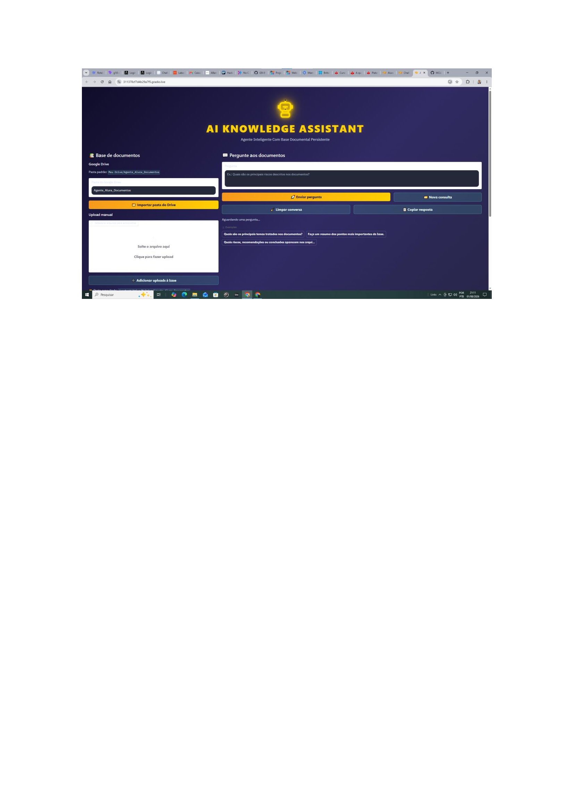
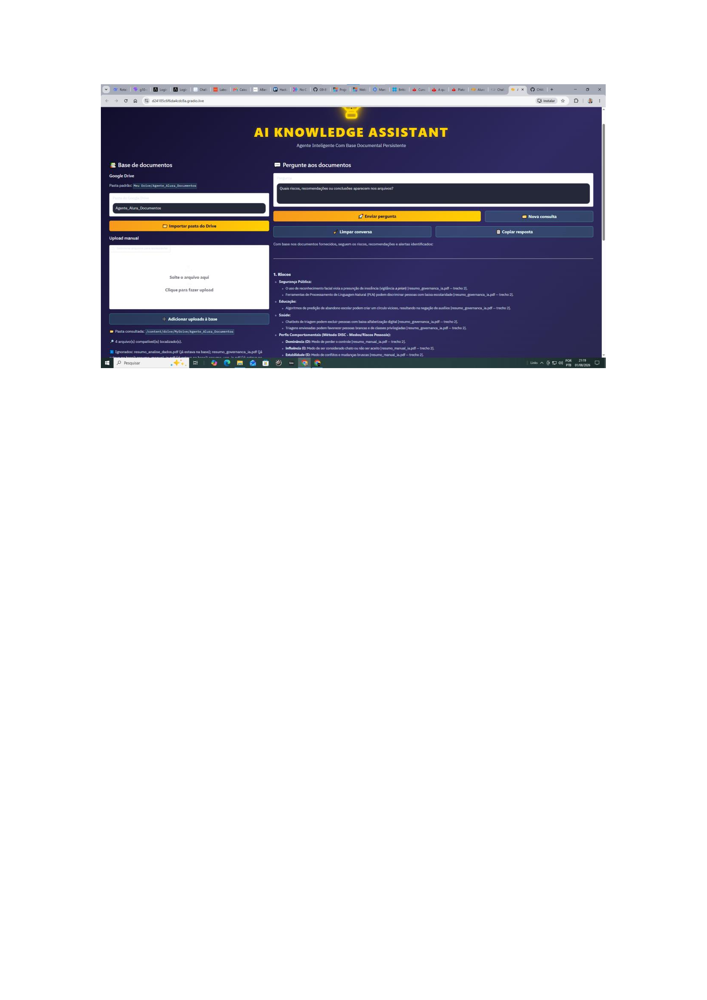

# AI KNOWLEDGE ASSISTANT

*AGENTE INTELIGENTE CO RAG PARA CONSULTA E GESTÃO DE CONHECIMENTO DOCUMENTAL*


---

### 🏆 Desafio

1. Criar um agente de IA
2. Processar documentos (PDF/CSV)
3. Fazer deploy na Oracle Cloud (OCI)

---

### 📌 Sobre o Projeto

Uma solução de Inteligência Artificial Generativa desenvolvida para transformar documentos técnicos em uma ***base de conhecimento pesquisável e persistente***.
A aplicação utiliza uma arquitetura baseada em ***Retrieval-Augmented Generation (RAG)***, combinando processamento de documentos, embeddings semânticos, busca vetorial com FAISS e Google Gemini para responder perguntas em linguagem natural utilizando o conteúdo recuperado da base documental.

O projeto foi desenvolvido no ***Challenge ONE AI Tech Builder — Oracle Next Education (ONE) / Alura***, explorando conceitos de IA Generativa, processamento de documentos, busca semântica e gestão de conhecimento.
Permitindo que você mantenha os documentos e o índice FAISS entre diferentes sessões no Google Colab e a outra, a possibilidade de se carregar novos arquivos, criando assim novas bases de dados. 

---

### 🎯 Objetivo

Desenvolver um assistente inteligente capaz de transformar documentos pessoais ou corporativos em uma base de conhecimento consultável por meio de linguagem natural.
A solução busca reduzir o esforço necessário para localizar e interpretar informações distribuídas em documentos extensos, permitindo que o usuário realize perguntas e receba respostas contextualizadas a partir do conteúdo disponível na base.

---

### 💡 Solução Proposta

O AI Knowledge Assistant processa os documentos adicionados à base, divide o conteúdo em trechos menores (chunks), gera representações vetoriais (embeddings) e cria um índice utilizando FAISS.
Quando uma pergunta é realizada, o sistema utiliza busca por similaridade para localizar os trechos semanticamente mais relevantes e fornece esse contexto ao modelo de linguagem para geração da resposta.

```text

Documentos
PDF | DOCX | TXT | MD
        ↓
Extração de Texto
        ↓
Divisão em Chunks
        ↓
Sentence Transformers
        ↓
Embeddings
        ↓
FAISS
Indexação Vetorial
        ↓
Busca por Similaridade
        ↓
Contexto Recuperado
        ↓
Google Gemini
        ↓
Resposta em Linguagem Natural

```
---

### ✨ Principais Funcionalidades

📂 Gestão da Base Documental
- Importação automática de documentos armazenados no Google Drive
- Upload manual de novos documentos
- Suporte a PDF, DOCX, TXT e Markdown
- Possibilidade de criação e atualização de diferentes bases documentais

🧠 Busca Semântica
- Divisão automática dos documentos em chunks
- Geração de embeddings semânticos
- Indexação vetorial com FAISS
- Recuperação dos trechos mais relevantes para cada consulta

💬 Consulta em Linguagem Natural

- O usuário pode realizar perguntas diretamente sobre os documentos armazenados na base.
- O sistema recupera o contexto relevante e utiliza o Google Gemini para produzir respostas contextualizadas.

💾 Persistência da Base de Conhecimento

A base é armazenada no Google Drive, permitindo preservar:

- Documentos processados
- Chunks de texto
- Metadados
- Índice vetorial FAISS

Dessa forma, o índice pode ser reutilizado entre diferentes sessões do Google Colab sem necessidade de reconstrução completa da base.

📤 Recursos adicionais
- Exportação da conversa em arquivo .txt
- Limpeza do histórico da conversa
- Exemplos de perguntas
- Interface interativa desenvolvida com Gradio

--- 

### ❗ Diferencial
Diferente de buscadores tradicionais, o agente **compreende o contexto** e responde em **linguagem natural**, sem que o usuário precise ler documentos extensos.

---

### 🏗️ Arquitetura da Solução

```
🏗️ Arquitetura da Solução
                   ┌─────────────────────┐
                   │     Documentos      │
                   │ PDF DOCX TXT MD     │
                   └──────────┬──────────┘
                              ↓
                   ┌─────────────────────┐
                   │  Extração de Texto  │
                   └──────────┬──────────┘
                              ↓
                   ┌─────────────────────┐
                   │       Chunks        │
                   └──────────┬──────────┘
                              ↓
                   ┌─────────────────────┐
                   │     Embeddings      │
                   │Sentence Transformers│
                   └──────────┬──────────┘
                              ↓
                   ┌─────────────────────┐
                   │        FAISS        │
                   │   Vector Database   │
                   └──────────┬──────────┘
                              ↑
                              │
Pergunta → Embedding → Busca por Similaridade
                              │
                              ↓
                   ┌─────────────────────┐
                   │ Contexto Recuperado │
                   └──────────┬──────────┘
                              ↓
                   ┌─────────────────────┐
                   │    Google Gemini    │
                   └──────────┬──────────┘
                              ↓
                   ┌─────────────────────┐
                   │      Resposta       │
                   └─────────────────────┘
```

---

### 🎨 Interface Personalizada
Este agente possui uma interface moderna com : 

- Temas personalizáveis (azul, roxo, verde, laranja, escuro)
- Upload de documentos via interface
- Exemplos de perguntas prontas para uso
- Respostas em linguagem natural baseadas nos documentos

---

### 🛠️ Tecnologias

- **Python**: Desenvolvimento da solução
- **Google Colab**: Ambiente de desenvolvimento e execução
- **Google Gemini**: Modelo de linguagem para geração de respostas
- **Gradio**: Criação da interface web interativa
- **Sentence Transformers**: Geração de embeddings para busca semântica
- **FAISS**: Indexação e busca vetorial de alta performance
- **PyPDF/PyPDF2**: Leitura e extração de arquivos PDF, DOCX, TXT e MD
- **python-docx**: Processamento de documentos DOCX
- **Google Drive**: Armazenamento persistente dos documentos e da base de dados (chunks, metadados e índice)

---

### 📚 Base de Conhecimento utilizada

Para demonstração da solução, foi construída uma base documental envolvendo temas relacionados a Inteligência Artificial, Governança de IA e Análise de Dados.
Entre os documentos utilizados estão: 

- 📄 Governança de IA no Setor Público
- 📘 Manual de Inteligência Artificial
- 📚 Inteligência Artificial: Avanços e Tendências
- 📊 Análise de Dados: Da Teoria à Prática

A arquitetura permite substituir ou ampliar essa base com novos documentos.

---

### 🖥️ Interface

- Foi desenvolvida utilizando Gradio, permitindo gerenciar a base documental e realizar consultas diretamente pelo navegador.

**Interface principal**

- Permite selecionar uma base armazenada no Google Drive, adicionar novos documentos e realizar perguntas em linguagem natural.

**💬 Exemplo de consulta e resposta**

- Após a consulta, o agente recupera informações relevantes da base documental e apresenta uma resposta estruturada ao usuário.

**💾 Persistência no Google Drive**

- A solução mantém uma estrutura persistente para evitar a reconstrução da base após cada sessão.

```
Google Drive/
│
├── Agente_Alura_Documentos/
│   ├── documento_01.pdf
│   ├── documento_02.docx
│   └── documento_03.txt
│
└── alura_agente_base/
    ├── chunks.pkl
    ├── metadados.json
    ├── indice.faiss
    └── arquivos/

```

Essa abordagem permite reutilizar documentos, embeddings e índices vetoriais em diferentes sessões.

---

### 📁 Estrutura do Repositório

```
CHALLENGE-ONE-AI-TECH-BUILDER-AI-Knowledge-Assitant/
│
├── docs/
│   └── prints/
│
├── Challenge_Alura_Agente.py
│
├── Analise-de-Dados-da-Teoria-a-Prática.pdf
├── Inteligencia-Artificial-Avanços-e-Tendências.pdf
├── Manual-de-Inteligencia-Artificial.pdf
├── Recomendações-de-Governança-Uso-da-IA-no-Poder-Público.pdf
│
└── README.md
```

---

### 🔐 Segurança

As credenciais de acesso aos serviços externos não devem ser armazenadas diretamente no código ou versionadas no GitHub.
Para execução do projeto, as chaves de API devem ser configuradas utilizando mecanismos apropriados de gerenciamento de secrets do ambiente de execução.

---

### 🗺️ Roadmap

Possíveis evoluções futuras:

- Implementação de Agentic RAG
- Orquestração de fluxos utilizando LangGraph
- Busca híbrida semântica + palavras-chave
- Avaliação automática da qualidade das respostas
- Observabilidade do pipeline RAG
- Ampliação dos mecanismos de citação e rastreabilidade das fontes
- Containerização com Docker
- API REST para integração com outros sistemas
- Deploy persistente em Cloud

---

## 📸 Demonstração da Aplicação

A interface do AI Knowledge Assistant foi desenvolvida com **Gradio** e executada em ambiente Google Colab.
Como a aplicação utiliza uma instância temporária do Gradio, o endereço público é gerado durante a execução e não permanece disponível após o encerramento da sessão.

### Interface principal

*📄 Agente Funcionando*

### 💬 💬 Exemplo de consulta e resposta

*💬 Exemplo de pergunta e 🎯 resposta completa e estruturada ao agente* 

---

### 📚 Contexto Acadêmico

- Projeto desenvolvido no Challenge ONE AI Tech Builder, integrante do programa Oracle Next Education (ONE) / Alura.
- O desafio teve como objetivo aplicar conceitos de Inteligência Artificial na construção de uma solução capaz de processar documentos e permitir sua consulta utilizando linguagem natural.📚 Contexto Acadêmico
- Projeto desenvolvido no Challenge ONE AI Tech Builder, integrante do programa Oracle Next Education (ONE) / Alura.
- O desafio teve como objetivo aplicar conceitos de Inteligência Artificial na construção de uma solução capaz de processar documentos e permitir sua consulta utilizando linguagem natural.

--- 

### 🤝 Como Contribuir

1. Faça um Fork do projeto
2. Crie uma branch (`git checkout -b feature/nova-funcionalidade`)
3. Commit suas mudanças (`git commit -m 'Adiciona nova funcionalidade'`)
4. Push para a branch (`git push origin feature/nova-funcionalidade`)
5. Abra um Pull Request

--- 

###@ 🙏 Agradecimentos

- Oracle Next Education (ONE) - Pela Oportunidade e Mentoria
 
- OCI - Pela Infraestrutura

- Mentores e Organizadores - Pelo Suporte e Orientação

---

### 👨‍💻 Autor

**Marcus Guedes**
- LinkedIn: https://www.linkedin.com/in/marcusguedes/
- GitHub: https://github.com/MCLG1661

---

## ⭐ Projeto desenvolvido como CHALLENGE do ONE AI TECH BUILDER
